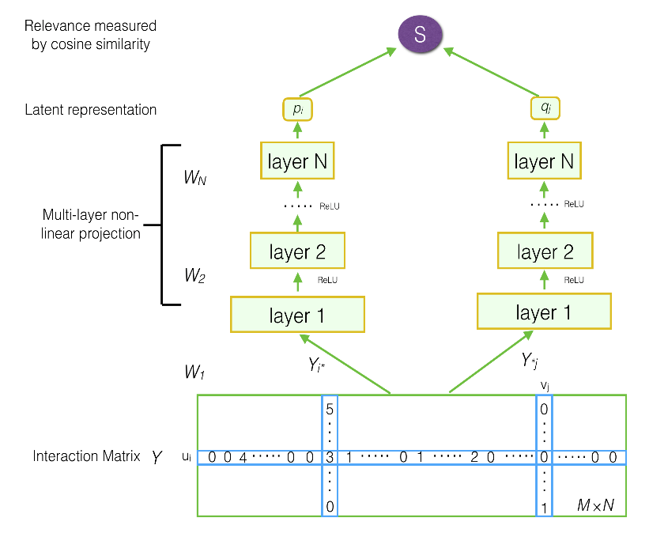

**Source paper**: [Deep Matrix Factorization Models for Recommender Systems - Baolin Yi](https://www.ijcai.org/Proceedings/2017/0447.pdf)

## 1. Introduction
The purpose of this project is to introduce a new technique for product recommendation, and to compare performance of this technique with existing technique or method. In this report, we will discuss product recommendation using collaborative filtering based on customers purchase behavior. Specifically, we will attemp to use **deep matrix factorization** to learn the representation of each product ($p$) and customer ($q$) from dataset of last 3 months purchases. By doing so we will be able to rank the relevance of each product to a customer by cosine similarity metric.For user $u$ and product $i$, relevance is denoted as $s_{ui}$:
$$
s_{ui} = \frac{p_{u}^Tq_{i}}{\lvert\lvert{p_{u}}\rvert\rvert * \lvert\lvert{q_{i}}\rvert\rvert} 
$$

In which, $p_{u}, q_{i} \subset R^N$ are representation vectors of user $u^{th}$ and product $i^{th}$. N is called number of latent components.

## 2. Implementation
### 2.1 Data


Dataset is extract from `Magento` database using this

Move this to appendix
```sql
SELECT 
    so.customer_id,
    soi.sku,
    SUM(qty_ordered) AS qty,
    SUM(row_total) AS amt
FROM 
    magento.sales_order so 

LEFT JOIN 
    magento.sales_order_items soi 
    ON soi.order_id = so.entity_id 
WHERE 
    so.created_at >= current_date - interval '3 month'
    AND soi.product_type = 'simple'

GROUP BY 1, 2    
```

### 2.1 Model architecture



<!--
**Outline**:
- Introduction: what is the purpose of this project, w
- How to evaluate performance of the recommendation engine
- Currently result


- Implementation:
    - Formal definition for the problem
    - Network architecture
    - Experimentation, hyper-parameters tunning
    - Performance: memory + run time
    - API

- Next steps:
    - Inferencing

- Note: 
    - Hardware specs for training:
        - CPU: Core(TM) i5-8400 CPU @ 2.80GHz
        - RAM: 16G
        - GPU: GeForce GTX 1050 Ti 


--!>
